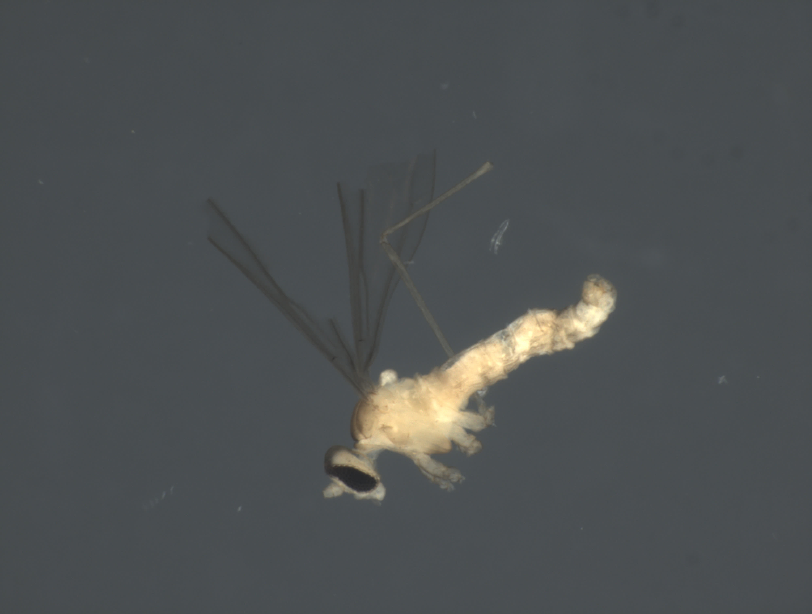
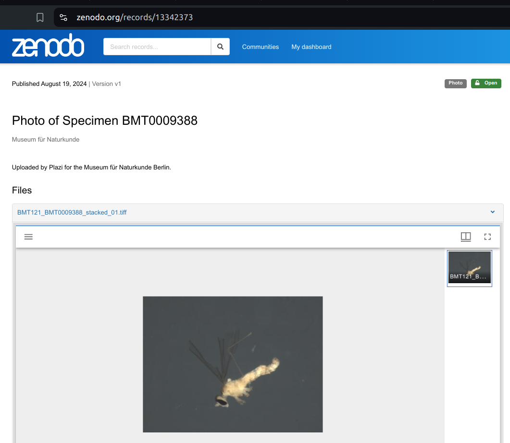
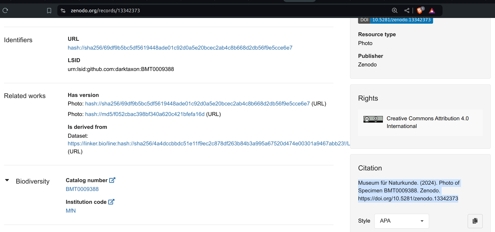

## Guiding Questions

 * How do *you* cite data?
 * How do you look up cited data *now*?
 * How do you look up cited data *40 years from now*?

## There's A Bug In Zenodo...



## There's A Bug in Zenodo...



## So How'd You Cite This Bug?

> Museum für Naturkunde. (2024). Photo of Specimen BMT0009388. Zenodo. https://doi.org/10.5281/zenodo.13342373





## How To Retrieve This Zenodo Bug Now?

Like this?

```
curl -L "https://doi.org/10.5281/zenodo.13342373"\
 > bug.tiff 
```

## How To Retrieve This Bug Now?

Wait a minute ...

```
cat bug.tiff
 |  cut -z -b1-62
```

```{ .html }
<!doctype html><html lang="en_US"><head><meta charset="UTF-8">
```

That ain't no bug, it is an HTML page.

## How To Retrieve This Bug Picture Now?

Take 2. 

 * turn on the internet (still there?)
 * open a web browser
 * load https://doi.org/10.5281/zenodo.13342373
   * and rely on a delicate and complex socio-technical network 
 * inspect page
 * use mouse to click on a link that looks like a bug picture
 * download image and **trust** its authenticity

## DOI Economics and Redirection


## How To Retrieve This Bug Picture 40 Years From Now?

> Museum für Naturkunde. (2024). Photo of Specimen BMT0009388. Zenodo. https://doi.org/10.5281/zenodo.13342373

Likely will not work due to intricate network of dependencies.

## How To Retrieve This Bug Picture 40 Years From Now?

### Proposal: Sign the citation ^[Elliott M.J., Poelen, J.H. & Fortes, J.A.B. (2023) Signing data citations enables data verification and citation persistence. *Sci Data*. https://doi.org/10.1038/s41597-023-02230-y [hash://sha256/f849c870565f608899f183ca261365dce9c9f1c5441b1c779e0db49df9c2a19d](https://linker.bio/hash://sha256/f849c870565f608899f183ca261365dce9c9f1c5441b1c779e0db49df9c2a19d)] 

... by adding some digital fingerprints of the image.

> Museum für Naturkunde. (2024). Photo of Specimen BMT0009388. Zenodo. https://doi.org/10.5281/zenodo.13342373 
> **hash://md5/f052cbac398bf340a620c421bfefa16d**

## How To Retrieve This Bug Picture 40 Years From Now?


... by searching the world (in, and beyond, the internet) for the content with the unique fingerprint hash://md5/f052cbac398bf340a620c421bfefa16d .

 * https://linker.bio/hash://md5/f052cbac398bf340a620c421bfefa16d
 * https://zenodo.org/records/13342373/files/BMT121_BMT0009388_stacked_01.tiff
 * ```preston cat --remote https://zenodo.org hash://md5/f052cbac398bf340a620c421bfefa16d```
 * ```preston cat --remote https://softwareheritage.org hash://sha256/69df9b5bc5df5619448ade01c92d0a5e20bcec2ab4c8b668d2db56f9e5cce6e7```
 * ```preston cat --remote https://linker.bio,https://zenodo.org hash://md5/f052cbac398bf340a620c421bfefa16d```
 
## Let Us Carry Our Bug Pictures Into The Future...

```
preston cat\
 --remote "https://zenodo.org"\
 hash://md5/f052cbac398bf340a620c421bfefa16d\
 > bug.tiff
```


---

## Guiding Questions

 * How do *you* cite data?
 * How do you look up cited data *now*?
 * How do you look up cited data *40 years from now*?

---

## Extra

---

## Internet Is Designed For *Exchanging* Information 

> The internet is a powerful tool for exchanging digital information. But the Internet’s contents changes constantly: websites are launched and taken down, webpages change, and content gets archived or lost.^[Jorrit Poelen. 2024. Unleashing Digital Knowledge Into The Future. Accessed on 2024-02-06 at https://linker.bio [line:hash://sha256/8ac18eb75ff20d40d1d60bb6ad5a745eb528093d1ffbe373e3847c13146091eb!/L12](https://linker.bio/line:hash://sha256/8ac18eb75ff20d40d1d60bb6ad5a745eb528093d1ffbe373e3847c13146091eb!/L12)]

---

## Internet Is *Location-based*

> By design, a web address, or Uniform Resource Locator (URL), points to a specific internet location from which a resource, like a webpage, can be retrieved. However, a URL does not provide a way to verify that a retrieved webpage was the one we asked for. ^[Jorrit Poelen. 2024. Unleashing Digital Knowledge Into The Future. Accessed on 2024-02-06 at https://linker.bio [line:hash://sha256/8ac18eb75ff20d40d1d60bb6ad5a745eb528093d1ffbe373e3847c13146091eb!/L14](https://linker.bio/line:hash://sha256/8ac18eb75ff20d40d1d60bb6ad5a745eb528093d1ffbe373e3847c13146091eb!/L14)]

---

## Finding Content By Their Location Is ... Tricky

> Imagine using a URL-like reference to find a book at a library: instead of locating a book by what it is (e.g., title, author), you refer to a book by its location (e.g., third shelf on the second row next to the window). With this, a book becomes unfindable if moved to another shelf. And, if you do manage to find a book at the referenced location, how would you know you’ve found the book you are looking for? ^[Jorrit Poelen. 2024. Unleashing Digital Knowledge Into The Future. Accessed on 2024-02-06 at https://linker.bio [line:hash://sha256/8ac18eb75ff20d40d1d60bb6ad5a745eb528093d1ffbe373e3847c13146091eb!/L16](https://linker.bio/line:hash://sha256/8ac18eb75ff20d40d1d60bb6ad5a745eb528093d1ffbe373e3847c13146091eb!/L16)]


---

## Finding Content By Their (Summarized) Content Is ... What Librarians Do

> Instead of pointing to where books are located, librarians point to them using a bibliographic reference. For practical reasons, only a few identifying clues are included in such a reference (e.g., author, year of publication, title, and publisher). **So, librarians refer to content by what it is, and knowing where it may be located is secondary.** ^[Jorrit Poelen. 2024. Unleashing Digital Knowledge Into The Future. Accessed on 2024-02-06 at https://linker.bio [line:hash://sha256/8ac18eb75ff20d40d1d60bb6ad5a745eb528093d1ffbe373e3847c13146091eb!/L18](https://linker.bio/line:hash://sha256/8ac18eb75ff20d40d1d60bb6ad5a745eb528093d1ffbe373e3847c13146091eb!/L18)]


A bibliographic citation:

Darwin, C. 1859. On the Origin of Species. John Murray.

---


